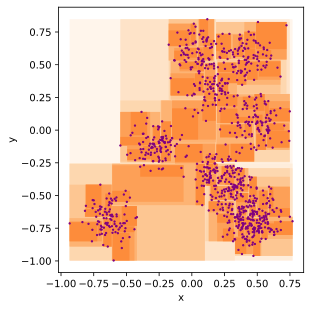
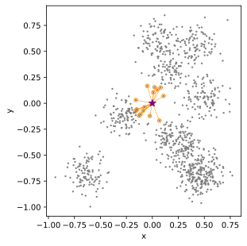
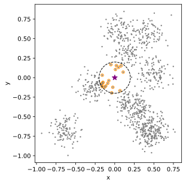
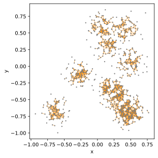
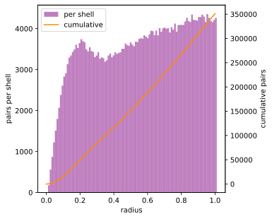

# kdtree

A kd-tree in C99. Supports nearest neighbor search, radius search, and dual-tree pair enumeration. A
Python wrapper is provided in `kdtree.py`.

## Usage

Compile `kdtree.c` alongside your project and include `kdtree.h`. See `Makefile` for recommended
compilation flags.

## Methods

**`kdtree_init`** Build a tree from a set of points stored in row-major order. The leaf size
controls how many points are stored in leaf nodes (0 uses the default of 16). Only Euclidean
distance is supported. The tree holds a pointer to the point data and does not copy it; the data
must remain valid for the lifetime of the tree.

<picture>
  <source media="(prefers-color-scheme: dark)" srcset="fig/tree-dark.svg">
  
</picture>

**`kdtree_deinit`** Free all memory associated with the tree.

**`kdtree_nearest`** Find the k nearest neighbors of a query point. Writes indices and distances to
caller-allocated arrays of size k. Results can optionally be sorted in ascending distance order.
Returns the number of results found.

<picture>
  <source media="(prefers-color-scheme: dark)" srcset="fig/nearest-dark.svg">
  
</picture>

**`kdtree_radius`** Find all points within a given radius of a query point. Writes up to a
caller-specified number of results. Returns the total count, which may exceed the buffer size.
Results can optionally be sorted in ascending distance order.

<picture>
  <source media="(prefers-color-scheme: dark)" srcset="fig/radius-dark.svg">
  
</picture>

**`kdtree_pairs`** Find all pairs within a given radius using dual-tree traversal. If no second tree
is given, finds unique self-pairs; otherwise finds cross-pairs between two trees of the same
dimension. Allocates and writes results to a caller-owned pointer; caller must free. Returns the
pair count.

<picture>
  <source media="(prefers-color-scheme: dark)" srcset="fig/pairs-dark.svg">
  
</picture>

**`kdtree_counts`** Count pairs within a series of radii (must be sorted ascending). For each
radius, writes the number of pairs whose distance does not exceed it. Counts can be cumulative or
per shell (between consecutive radii). Supports self-pairs and cross-pairs between two trees.

<picture>
  <source media="(prefers-color-scheme: dark)" srcset="fig/counts-dark.svg">
  
</picture>

## Performance

Benchmarked against `scipy.spatial.KDTree` on 2M points in 3D with a leaf size of 16. Nearest
neighbor search and radius search use 200K query points; pair and count operations run on the full
2M-point tree with a radius of 0.02.

| Operation               | kdtree |   scipy | speedup |
| :---------------------- | -----: | ------: | ------: |
| init                    | 5.649s |  5.675s |    1.0x |
| nearest                 | 7.102s |  6.843s |    1.0x |
| radius sorted           | 6.360s |  8.051s |    1.3x |
| radius unsorted         | 6.576s |  7.711s |    1.2x |
| pairs set               | 5.876s |  8.858s |    1.5x |
| pairs ndarray           | 3.300s |  5.385s |    1.6x |
| cross-pairs set         | 3.399s |  5.443s |    1.6x |
| cross-pairs ndarray     | 2.941s |  5.449s |    1.9x |
| counts cumulative       | 5.949s | 22.479s |    3.8x |
| counts per shell        | 5.951s | 17.438s |    2.9x |
| cross-counts cumulative | 4.500s |  7.355s |    1.6x |
| cross-counts shell      | 4.503s |  6.179s |    1.4x |
| counts weighted         | 6.400s | 22.187s |    3.5x |
| cross-counts weighted   | 4.625s |  7.690s |    1.7x |

Run `make bench` to reproduce. Pair and count operations benefit most from dual-tree pruning.

## Implementation notes

- Split axis is chosen as the dimension with the largest coordinate spread
- Median split is found with quickselect, giving O(n log n) build time
- Nearest neighbor search uses a max-heap for large counts and an insertion-sorted array otherwise
- Pair search and counting use dual-tree traversal, pruning node pairs whose bounding boxes are
  farther apart than the search radius
